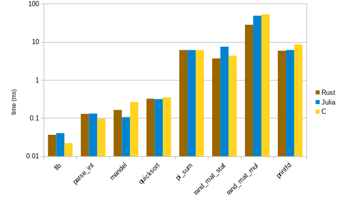

# Julia's micro-bench in Rust

This repository attempts to replicate the [micro benchmark](https://github.com/JuliaLang/julia/tree/master/test/perf/micro) in the Julia repository ([/test/perf](https://github.com/JuliaLang/julia/tree/master/test/perf)) with a Rust implementation, which aims to make a general performance comparison among other programming languages.

The resulting program is based on the C implementation, but it's still mostly idiomatic Rust and does not have unsafe code.
OpenBLAS is used as the BLAS implementation via the `blas` crate.

The project is experimental, and might still have bugs or unfair optimizations. Feel free to point them out if you find them.

## Building and running

Use the **nightly** channel of the Rust compiler. With rustup, installing the nightly toolchain and executing `rustup override set nightly` is sufficient. Then:

```bash
# in development mode (no optimizations)
cargo run
```

```bash
# in release mode (best performance)
cargo run --release
```

## Results

When comparing with the C benchmark on the same machine:



## License

Apache-2.0 / MIT

